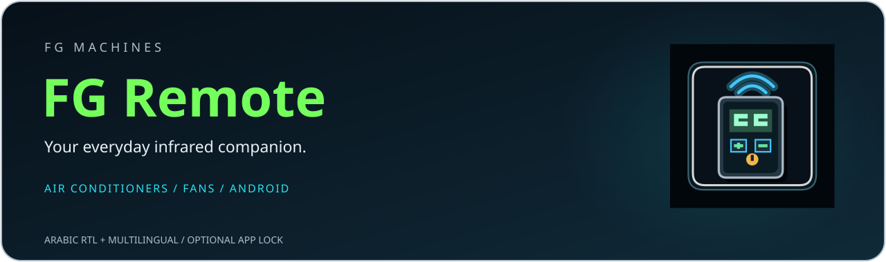
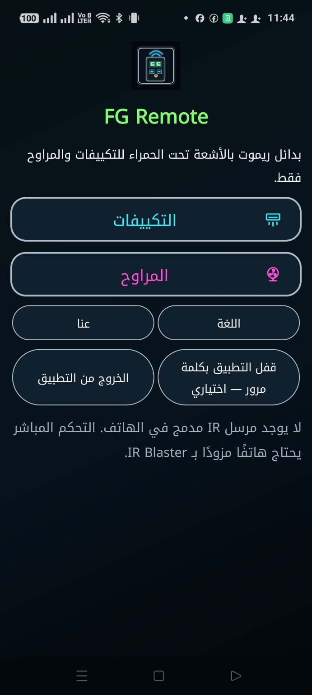
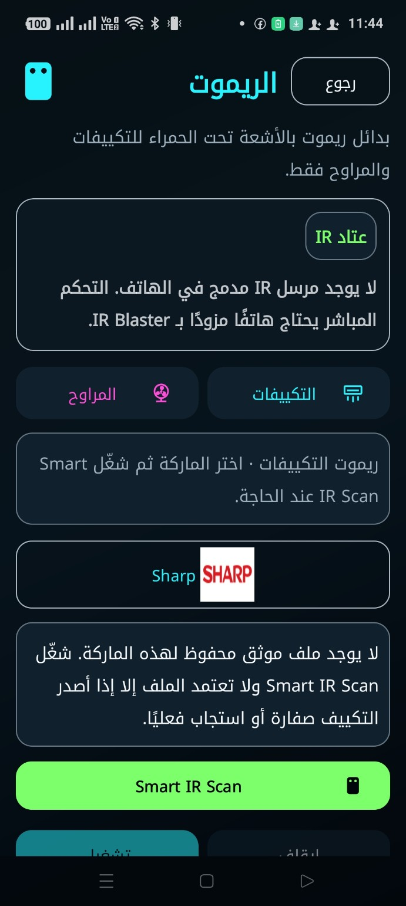
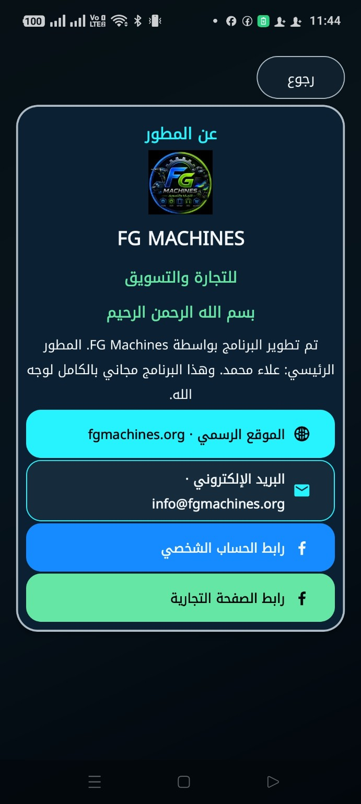
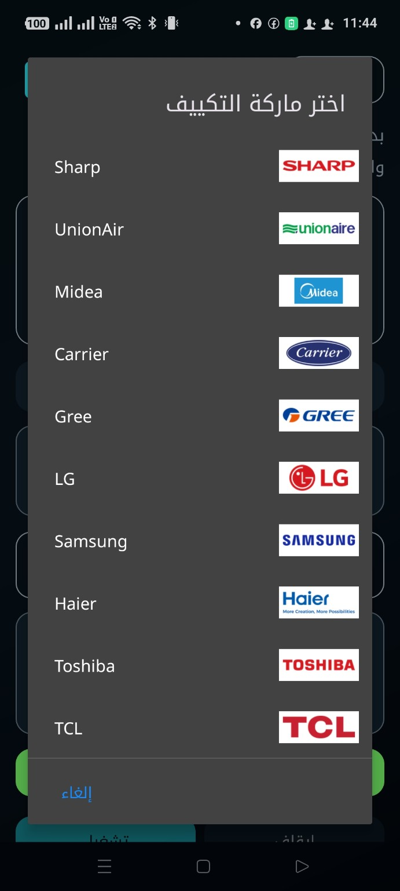
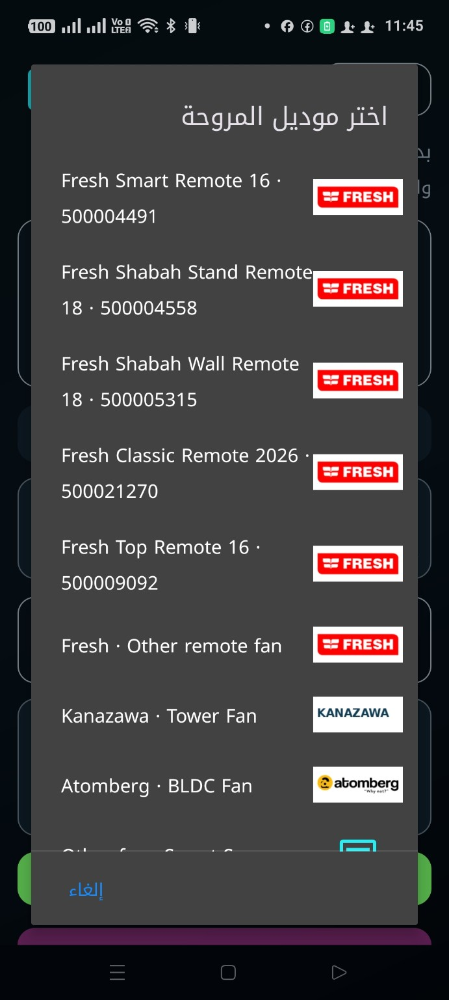

  

<h1>ريموتك، في مكان واحد</h1>

تطبيق أندرويد مستقل من <strong>FG Machines</strong> يجمع ريموتات التكييف والمراوح في واجهة عربية واضحة، بأسماء الشركات وشعاراتها، مع اختيار الملفات وتجربة الأوامر على جهازك.

<strong>الإصدار الحالي: FG Remote 1.0.3 · Build 4</strong>

<a href="https://github.com/FGMachines/FG-Remote/releases/tag/v1.0.3"><strong>تفاصيل الإصدار 1.0.3 والتحقق من الملف</strong></a>

<strong>العربية RTL · لغات متعددة · قفل اختياري · تصوير الشاشة متاح</strong>

> **قبل التحميل:** إرسال الأوامر يحتاج هاتفًا مزوّدًا بمرسل أشعة تحت الحمراء **IR Blaster**، مع تكييف أو مروحة متوافقة. التطبيق لا يضيف مرسل IR إلى هاتفك. ظهور الشركة أو الموديل في القائمة وحده لا يؤكد التوافق؛ التأكيد باستجابة جهازك للأمر.

## تجربة حقيقية من الهاتف

جولة داخل **FG Remote 1.0.3**: الرئيسية، والتحكم، والشركات، وصفحة المطور.

<strong>الرئيسية · شاشة التحكم · المطور</strong>

<strong>شعارات واضحة بجوار أسماء الشركات والموديلات</strong> اضغط أي صورة لفتحها بالحجم الكامل.

## ما الذي يقدمه FG Remote؟

| الميزة | فائدتها لك |
|---|---|
| التكييفات والمراوح | اختيار نوع الجهاز من الرئيسية بأيقونات واضحة |
| أسماء الشركات وشعاراتها | الوصول إلى الماركة أو الموديل بسهولة |
| اختيار الملف وSmart IR Scan | تجربة ملفات التحكم عند الحاجة، ثم تأكيد استجابة الجهاز فعليًا |
| العربية والخط الكوفي | واجهة عربية باتجاه RTL، مع الإنجليزية والتركية والإسبانية والألمانية |
| قفل بكلمة مرور — اختياري | فعّله أو تخطّه، مع تغيير كلمة المرور وتعطيله بعد التحقق |
| صفحة المطور | الموقع والبريد وروابط FG Machines داخل التطبيق |
| تطبيق مستقل | يُثبت بجوار FG Link؛ الريموت ما زال موجودًا داخل FG Link أيضًا |

التحكم المحلي بالأشعة تحت الحمراء لا يحتاج حساب FG Link أو Controller أو اتصال VPS. الشعارات للتعريف بالماركات، ولا تعني أن التطبيق صادر عنها أو معتمد منها. بعض الملفات تحتاج التجربة على جهازك؛ لا نعرضها كتوافق مؤكد قبل الاختبار.

## ابدأ في أربع خطوات

1. **تأكد من عتاد هاتفك:** يجب أن يحتوي مرسل IR للتحكم المباشر. راجع رسالة «عتاد IR» داخل التطبيق.
2. **اختر نوع الجهاز:** افتح «التكييفات» أو «المراوح»، ثم اختر الشركة أو الموديل المناسب.
3. **وجّه الهاتف للجهاز:** جرّب ملف التحكم، أو استخدم **Smart IR Scan** عند الحاجة. لا تعتمد الملف إلا بعد استجابة التكييف أو المروحة فعليًا.
4. **احتفظ بالاختيار المناسب:** استخدمه للتحكم، ويمكنك تفعيل قفل البرنامج بكلمة مرور إذا رغبت.

**لا يوجد IR في الهاتف؟** يمكنك تصفح القوائم، لكن إرسال أوامر الأشعة تحت الحمراء لن يعمل.

## الأسئلة والحلول — جروبنا على فيسبوك

**[انضم إلى مجتمع FG Machines لطرح الأسئلة ومشاركة الحلول](https://www.facebook.com/share/g/19J8NVxQX8/)**

عند طلب المساعدة، اكتب موديل الهاتف، ونوع الجهاز وماركته وموديله، وإصدار التطبيق، والملف الذي جرّبته. أرفق صورة للرسالة الظاهرة أو فيديو قصير للاستجابة. لا تنشر كلمة مرور أو بيانات حساب خاصة.

## التحميل والإصدارات

النسخة الرسمية الحالية هي **FG Remote 1.0.3 / versionCode 4**، وتم نشرها كـ **Latest Release** بعد التحقق من الحزمة والتوقيع وملف APK.

**[تحميل FG Remote 1.0.3 مباشرة — APK](https://github.com/FGMachines/FG-Remote/releases/download/v1.0.3/FG-Remote-1.0.3-v4-Hardened-Signed.apk)** · **[فتح صفحة الإصدار](https://github.com/FGMachines/FG-Remote/releases/tag/v1.0.3)** · **[كل الإصدارات](https://github.com/FGMachines/FG-Remote/releases)**

SHA-256 للـAPK الرسمي: `14cd455739fba667db33bb290a7ae081c80a9d0590c6e8ac0a2b6461ee2f2f23`.

حافظ على بياناتك بتثبيت التحديث الرسمي فوق نسختك الحالية، مع اسم الحزمة والتوقيع الأصليين.

## حماية المشروع

المستودع العام ده مخصص **للتوزيع والشرح وملفات التحقق فقط**. السورس كود، ملفات البناء الداخلية، مفاتيح التوقيع، كلمات المرور وملفات R8 mapping غير منشورة هنا.

نسخة الإنتاج المنشورة مفعّل فيها **R8 / Code Shrinking / Resource Shrinking**، وموقّعة بتوقيع FG Machines الرسمي. ملفات التوقيع نفسها لا يتم وضعها داخل المستودع العام.

---

<strong>FG MACHINES</strong> <a href="https://fgmachines.org">الموقع الرسمي</a> · <a href="mailto:info@fgmachines.org">البريد الإلكتروني</a> · <a href="https://www.facebook.com/share/g/19J8NVxQX8/">مجتمع الأسئلة والحلول</a>

